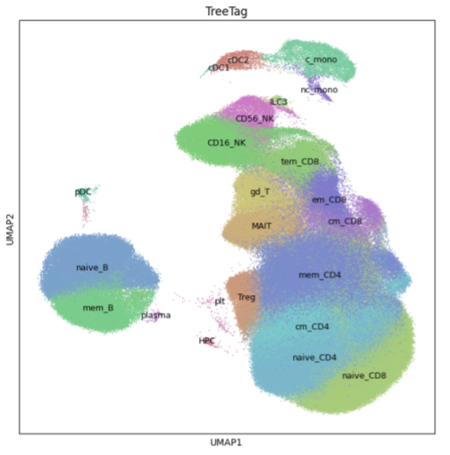
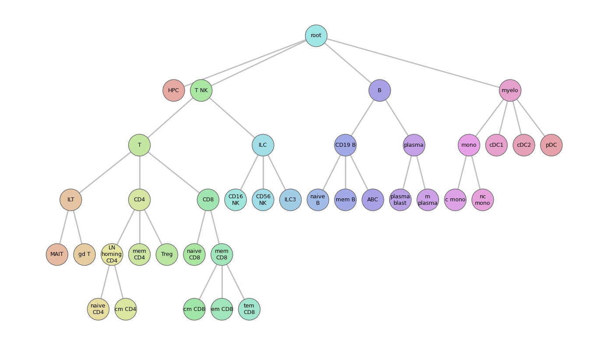

# TreeTag

TreeTag is a lightweight Python package that automatically annotates single-cell RNA-seq data. It reads two editable YAML files: one lays out the hierarchy of cell types, and the other lists positive and negative marker genes. TreeTag promotes quick, interactive adjustment of marker sets and ontologies by keeping marker rules human-readable, and performing near-instant re-annotation. Marker pruning avoids misleading assignments from dataset- or batch-specific markers, while smoothing helps overcome inherent scRNA-seq sparsity by integrating consistent signals from a PCA-driven neighborhood embedding.

---

## Features

- Integrates smoothly with AnnData and scanpy.

- Reads human‑editable YAMLs for the ontology and for positive/negative markers and builds the ontology as a graph (via igraph) for hierarchical traversal **(init_tree)**.

- Visualizes the ontology to inspect and validate structure **(plot_tree)**.

- Pre‑scales marker columns (sparse‑friendly), cache, and run lean matrix operations for fast scoring. **(TreeTag)**

- Computes hierarchical marker‑based scores top‑down; optionally applying KNN smoothing and majority vote using a PCA‑driven neighborhood embedding. **(TreeTag toggles)**

- Assigns cell‑type tags **(TreeTag in AnnData object)**.

- Prunes unreliable markers when they fail to separate the intended type  **(TreeTag toggles)**.

- Exposes per‑cell scores for manual inspection within AnnData/scanpy. **(*_score in AnnData object)**.

- Detects likely doublets after scoring, using per‑node scores to flag candidates for review/removal **(find_doublets)**.

---

## Installation
From PyPI (recommended)
```bash
pip install treetag
```
Upgrade
```bash
pip install --upgrade treetag
```
Verify installation
```bash
python -c "import treetag, sys; print('TreeTag', treetag.__version__)"
```
---
## Quickstart
```python
import scanpy as sc
import treetag as tt

# 1) Load data (PBMC works best with the included examples)
adata = sc.read_h5ad("my_data.h5ad")

# 2) (Recommended) Harmonize gene names
tt.convert(adata, prefer_var_cols=("feature_name"))

# 3) Neighbors (needed only if smoothing/majority_vote=True)
sc.pp.pca(adata)
sc.pp.neighbors(adata, use_rep="X_pca")

# 4) Copy example YAMLs to a local folder so you can edit them
tree_yaml, markers_yaml = tt.copy_example_yaml(dest="data")  # returns paths

# 5) Run TreeTag (explicit YAML paths; no defaults)
tt.TreeTag(
    adata,
    tree_yaml=tree_yaml,                 # e.g., data/PBMC_tree.yaml
    markers_yaml=markers_yaml,           # e.g., data/PBMC_markers.yaml
    root="root",
    smoothing=True,
    majority_vote=True,
    save_scores=True,
)

# 6) Inspect results
print(adata.obs["TreeTag"].value_counts())
sc.pl.umap(adata, color="TreeTag", size=8)
```

## YAML File Formats

#### Ontology YAML

```yaml
root:
  T_NK:
    CD4_T:
      Treg:
      Th:
      _Tfh:
    CD8_T:
  B:
    Naive_B:
    Memory_B:
  Myeloid:
    Mono:
    DC:
```

**`!` note:** Any key starting with "_" is treated as **disabled**; the cell-type and its entire subtree are skipped.

#### Markers YAML

```yaml
T_NK: [CD2, IL32, CD7, CD247, CD3E, LCK, IFITM1, GIMAP7, -MS4A1]
CD4_T: [CD4, TRAT1, ICOS, GPR183, CD40LG, IL6ST, -CD8A, -CD8B]
Treg: [FOXP3, RTKN2, IL2RA, IKZF2, CTLA4, TNFRSF18, TIGIT, -CD40LG]
```
**`!` note:** At least 2 positive markers are needed per cell type. Negative markers start with "-" and are not obligatory. 

## Function reference

## `TreeTag`

**What it does:** Hierarchical cell‑type tagging using positive/negative markers.

**Signature:**

```python
TreeTag(
    adata, # The AnnData object to analyze
    tree_yaml: str, # The YAML file describing the cell ontology
    markers_yaml: str, # The YAML file with the positive and negative markers for each cell in tree_yaml
    root: str = 'root', # start node in the ontology (e.g., if your dataset only contains T and NK cells then root="T_NK")
    min_marker_count: int = 2, # the minimum number of positive markers required for a cell type to be scored
    verbose: bool = False, # print per-split diagnostics and pruning details
    smoothing: bool = True, # KNN score smoothing using neighbors graph in adata.obsp
    majority_vote: bool = True, # one-pass label consensus using the same neighbors graph
    save_scores: bool = False, # write <cell type>_score columns to adata.obs
    min_score: float = 0.0, # gate final labels below this score to "unknown" (0 disables)
    min_pruning_fc: float = 1.5 # prune +markers per child if FC vs avg(other siblings) < this

**Writes:** `adata.obs["TreeTag"]`; if `save_scores=True`, also `<node>_score` columns.

**Requires (if enabled):** neighbors in `adata.obsp` for `smoothing`/`majority_vote`.

**Common errors (and fixes):**

* *No neighbor graph:* run `sc.pp.neighbors(adata, use_rep="X_pca")` **or** set `smoothing=False, majority_vote=False`.
* *No subtree markers found:* check gene naming (symbols vs Ensembl), root, and `.raw` usage.
* *Neighbor shape mismatch:* rebuild neighbors **after** any cell filtering.
```
---

### `init_tree`

**What it does:** Loads ontology + markers, builds the graph, normalizes marker dicts. If adata is provided, omits missing markers.

**Signature:**

```python
def init_tree(
    tree_yaml: str,              # Path to ontology tree YAML (nested dict of nodes)
    markers_yaml: str | None = None,  # Optional path to markers YAML; if None, skip marker loading
    root: str = "root",          # Name of the node to treat as subtree root
    adata=None,                  # Optional AnnData; if given, markers are filtered to its genes
):
```

**Returns:**

* `G`: graph of the ontology (node names in `G.vs["name"]`), with poaitive and negative marker attributes per node.

---

### `markers`

**What it does:** Returns marker genes for a node (optionally filtered to genes present in `adata`).

**Signature:**

```python
markers(
    cell_type: str,
    sign: str = "pos",            # "pos" or "neg"
    markers_yaml: str = "markers.yaml",
    tree_yaml: str = "ontology.yaml",
    adata=None,                    # optional filter to adata.var_names/raw.var_names
) -> list[str]
```

---

### `subscores`

**What it does:** Lists existing `<node>_score` columns under a root (useful after `TreeTag(save_scores=True)`).

**Signature:**

```python
subscores(
    root_cell: str,
    adata,
    markers_yaml: str,
    tree_yaml: str,
) -> list[str]
```

---

### `find_doublets`

**What it does:** Flags likely doublets **after scoring** using per‑node score patterns (e.g., strong scores for incompatible lineages).

**Signature (minimal):**

```python
find_doublets(
    adata,
    threshold: float = 0.25,   # heuristic overlap metric; implementation‑specific
    write: bool = True,
    key: str = "doublet_like",
) -> "pd.Series[bool] | np.ndarray[bool]"
```

**Writes (if `write=True`):** `adata.obs["doublet_like"]` boolean mask.

---

### `plot_tree`

**What it does:** Renders the ontology tree (optionally overlaying counts/assignments).

**Signature (typical):**

```python
plot_tree(
    tree_yaml: str | None = None,
    markers_yaml: str | None = None,
    root: str | None = None,
    G=None,                      # alternatively pass a prebuilt graph
    adata=None,                  # optional: color by counts/labels
    ax=None,
    layout: str = "rt",         # e.g., top‑down
) -> "matplotlib.axes.Axes"
```
---
##  Results Gallery
### A UMAP of PBMC cell types produced with TreeTag

---
### Visualization of the cell ontology producing the above UMAP

